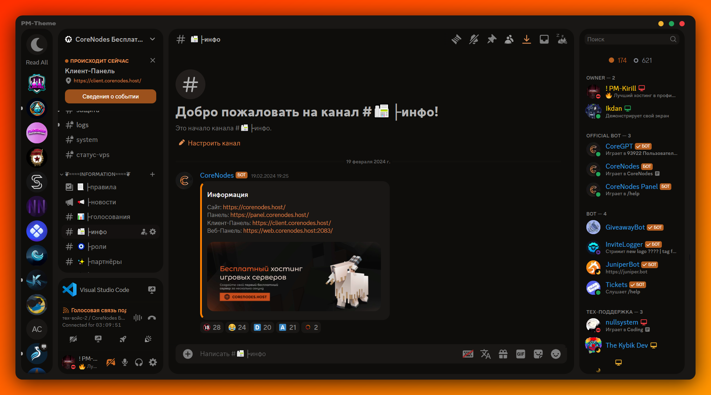
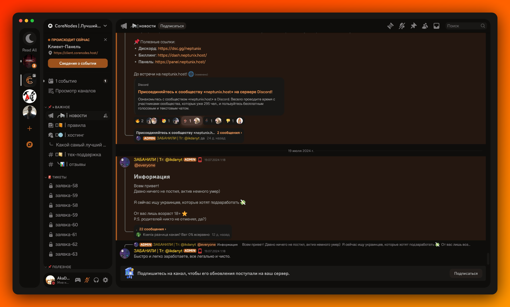

<p align="center">
    <a href="https://github.com/PM-KIRILL/PM-Theme.github.io"></a>
    <a href="https://github.com/PM-KIRILL/PM-Theme.github.io"></a>
    <a href="https://github.com/PM-KIRILL/PM-Theme.github.io"></a>
</p>



## 👁‍🗨 Предпросмотр

<details>
<summary>🖥 PM-Theme (Arch Linux/Windows)</summary>

</details>
<details>
<summary>💻 PM-Theme (MacOS)</summary>

</details>

## Использование

### [BetterDiscord](https://betterdiscord.app)/[Vencord](https://vencord.dev/)

1. Загрузите файл:

-  [PM-Theme](https://github.com/PM-KIRILL/PM-Theme.github.io/releases/download/PM-Theme/PM-Theme.css)

2. Скопируйте загруженный файл в папку тем BetterDiscord/Vencord.
3. Включите тему в настройках BetterDiscord/Vencord.

### Клиенты/Моды с поддержкой пользовательских CSS онлайн

- Online Themes:

```css
/* Веб-Тема */
https://raw.githubusercontent.com/PM-KIRILL/PM-Theme.github.io/main/PM-Theme.css
```

- Custom CSS:

```css
/* Веб-Тема */
@import url("https://raw.githubusercontent.com/PM-KIRILL/PM-Theme.github.io/main/PM-Theme.css")
```

## 🙋 Часто задаваемые вопросы

- В: **_"Может ли это привести к блокировке моего аккаунта?"_**
- О: Использование сторонних клиентов и внедрение пользовательских CSS противоречит Условиям использования. Хотя никто никогда не был забанен просто за использование модов клиента Discord, мы не несем ответственности за все, что может случиться с вашей учетной записью при использовании сторонних клиентов. Используйте по своему усмотрению!

&nbsp;

<p align="center"></p>
<p align="center">Авторские права &copy; 2024 <a href="https://github.com/PM-Kirill" target="_blank">PM-Kirill</a>
<p align="center"><a href="https://github.com/PM-KIRILL/PM-Theme.github.io/blob/main/LICENSE"></a></p>

[](https://github.com/pm-kirill)
<p align="center"> 
  Visitor count<br>
  
</p>
